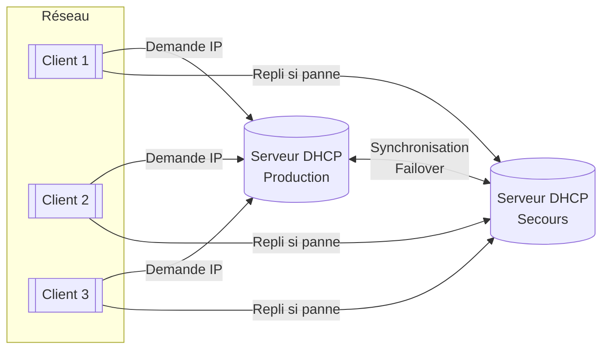
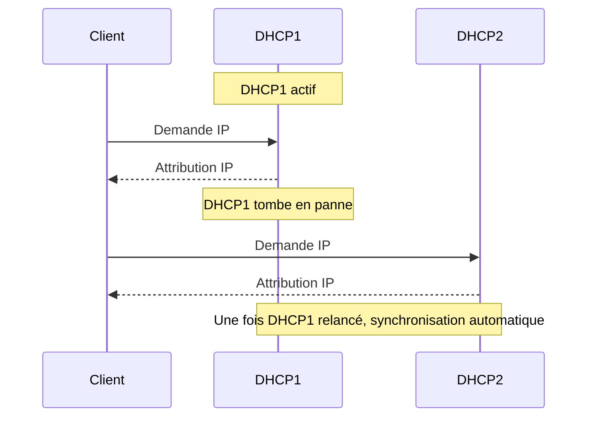

<div align="center">

  <br></br>
  
  <a href="https://github.com/0xCyberLiTech">
  
  </a>
  
  <br></br>

  <h2>Laboratoire numérique pour la cybersécurité, Linux & IT</h2>
  
  <p align="center">
      <a href="https://0xcyberlitech.github.io/">
        
      </a>
      <a href="https://github.com/0xCyberLiTech">
        
      </a>
      <a href="https://github.com/0xCyberLiTech/Cybersecurite/releases/latest">
        
      </a>
      <a href="https://github.com/0xCyberLiTech/Cybersecurite/blob/main/CHANGELOG.md">
        
      </a>
      <a href="https://github.com/0xCyberLiTech?tab=repositories">
        
      </a>
  </p>

</div>

<!-- Optimisation SEO : DHCP, Dynamic Host Configuration Protocol, serveur DHCP, configuration IP, adresse IP automatique, réseau, administration système, Linux, Debian, cybersécurité, sécurité informatique, IT, open source, tutoriels, guides, formation, expertise, étudiants, professionnels, bonnes pratiques, ressources techniques, infrastructure réseau, services réseaux, supervision, logs, monitoring, cloud, virtualisation, DevSecOps -->

<div align="center">
  
</div>

<div align="center">
  <p>
    <strong>Cybersécurité</strong>  • <strong>Linux Debian</strong>  • <strong>Sécurité informatique</strong> 
  </p>
</div>

---

## 🚀 À propos & Objectifs

Ce projet propose des solutions innovantes et accessibles en cybersécurité, avec une approche centrée sur la simplicité d’utilisation et l’efficacité. Il vise à accompagner les utilisateurs dans la protection de leurs données et systèmes, tout en favorisant l’apprentissage et le partage des connaissances.

Le contenu est structuré, accessible et optimisé SEO pour répondre aux besoins de :
- 🎓 Étudiants : approfondir les connaissances
- 👨‍💻 Professionnels IT : outils et pratiques
- 🖥️ Administrateurs système : sécuriser l’infrastructure
- 🛡️ Experts cybersécurité : ressources techniques
- 🚀 Passionnés du numérique : explorer les bonnes pratiques

---

# Tutoriel : Installer un serveur DHCP de secours (Failover) sous Debian 12/13

---

## 1. Introduction

Le protocole **DHCP Failover** permet à deux serveurs DHCP de fonctionner ensemble pour garantir une continuité de service en cas de panne. Si le serveur principal tombe, le serveur de secours prend le relais et attribue les adresses IP aux clients.

---

## 2. Présentation des serveurs : Production et Secours

Dans une architecture DHCP failover, deux serveurs collaborent :

- **Serveur de Production (DHCP1)**  
  Serveur principal gérant la majorité des demandes DHCP et l’attribution d’adresses IP.

- **Serveur de Secours (DHCP2)**  
  Serveur backup surveillant le serveur principal et prenant le relais en cas de panne, assurant ainsi la continuité du service.

Les deux serveurs échangent leurs informations de baux DHCP en temps réel pour éviter tout conflit d’adresses.

---

### Schéma de l’architecture (Mermaid)



---

## 3. Prérequis

- Deux serveurs Debian 12 ou 13 (ex : `dhcp1` et `dhcp2`)
- Accès root ou sudo
- Communication réseau entre les deux serveurs (même réseau ou VPN)
- Ouverture des ports TCP 647 entre les deux serveurs

---

## 4. Installation du serveur DHCP

Sur **chaque serveur** (dhcp1 et dhcp2) :

```bash
sudo apt update
sudo apt install isc-dhcp-server
```

---

## 5. Configuration du DHCP Failover

### 5.1. Fichier de configuration `/etc/dhcp/dhcpd.conf`

Configurer les deux serveurs pour le failover.

#### **Sur DHCP1 (Production) :**

```conf
authoritative;
ddns-update-style none;

failover peer "dhcp-failover" {
  primary;
  address 192.168.1.10;
  port 647;
  peer address 192.168.1.20;
  peer port 647;
  max-response-delay 60;
  max-unacked-updates 10;
  load balance max seconds 3;
  mclt 3600;
  split 128;
}

subnet 192.168.1.0 netmask 255.255.255.0 {
  pool {
    failover peer "dhcp-failover";
    range 192.168.1.100 192.168.1.200;
    option routers 192.168.1.1;
    option domain-name-servers 8.8.8.8, 8.8.4.4;
    option domain-name "mondomaine.local";
    default-lease-time 600;
    max-lease-time 7200;
  }
}
```

#### **Sur DHCP2 (Secours) :**

```conf
authoritative;
ddns-update-style none;

failover peer "dhcp-failover" {
  secondary;
  address 192.168.1.20;
  port 647;
  peer address 192.168.1.10;
  peer port 647;
  max-response-delay 60;
  max-unacked-updates 10;
  load balance max seconds 3;
  mclt 3600;
}

subnet 192.168.1.0 netmask 255.255.255.0 {
  pool {
    failover peer "dhcp-failover";
    range 192.168.1.100 192.168.1.200;
    option routers 192.168.1.1;
    option domain-name-servers 8.8.8.8, 8.8.4.4;
    option domain-name "mondomaine.local";
    default-lease-time 600;
    max-lease-time 7200;
  }
}
```

---

### 5.2. Configuration de l’interface réseau

Dans `/etc/default/isc-dhcp-server` :

```sh
INTERFACESv4="eth0"
```
Adaptez selon votre interface réseau.

---

## 6. Démarrage et synchronisation des serveurs

1. **Démarrez le serveur principal en premier :**
   ```bash
   sudo systemctl start isc-dhcp-server
   ```
2. **Attendez 1 minute**, puis démarrez le serveur de secours :
   ```bash
   sudo systemctl start isc-dhcp-server
   ```

---

## 7. Vérification du fonctionnement

- **Vérifiez le statut du service :**
  ```bash
  sudo systemctl status isc-dhcp-server
  ```
- **Vérifiez les logs :**
  ```bash
  sudo tail -f /var/log/syslog
  ```
  Vous devez voir des échanges “peer” entre les deux serveurs.

---

## 8. Test du failover



---

## 9. Conseils & bonnes pratiques

- Sauvegardez régulièrement le fichier `dhcpd.leases`.
- Surveillez les logs pour détecter tout problème de synchronisation.
- Testez la bascule au moins une fois par trimestre.
- Documentez votre architecture et vos procédures.

---

## 10. Références

- [Documentation officielle ISC DHCP](https://kb.isc.org/docs/isc-dhcp-44-manual-pages-dhcpdconf)
- [Failover Protocol](https://kb.isc.org/docs/isc-dhcp-44-manual-pages-dhcpdconf#failover-peer)
- [Mermaid Live Editor](https://mermaid.live/) pour visualiser les schémas

---

<div align="center">
  <a href="https://github.com/0xCyberLiTech" target="_blank" rel="noopener">
    
  </a>
</div>

<div align="center">
  <b>🔒 Un guide proposé par <a href="https://github.com/0xCyberLiTech">0xCyberLiTech</a> • Pour des tutoriels accessibles à tous. 🔒</b>
</div>

