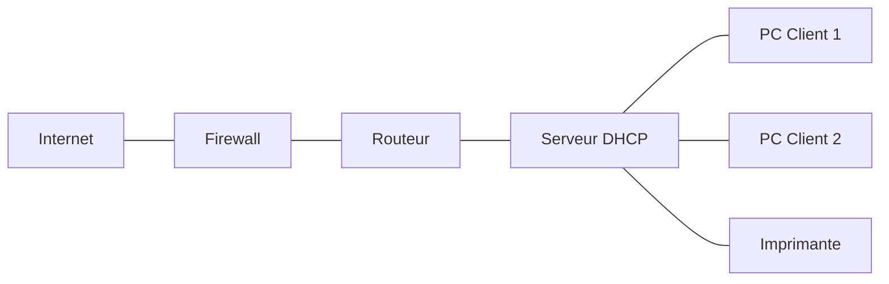
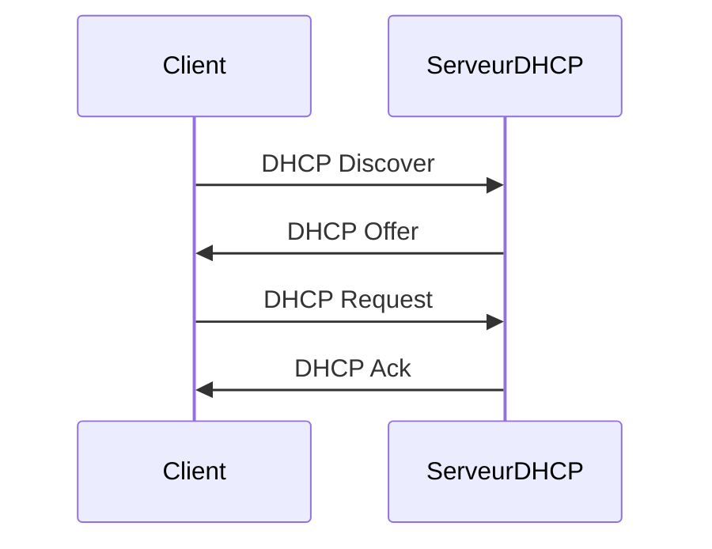
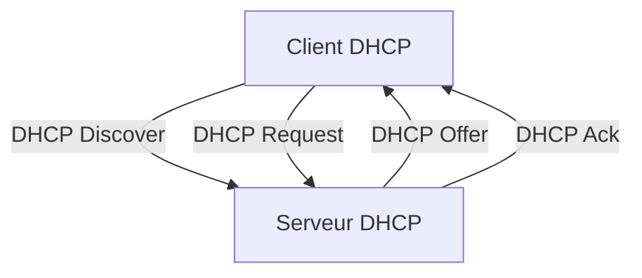

<div align="center">

  <br></br>
  
  <a href="https://github.com/0xCyberLiTech">
  
  </a>
  
  <br></br>

  <h2>Laboratoire numérique pour la cybersécurité, Linux & IT</h2>
  
  <p align="center">
      <a href="https://0xcyberlitech.github.io/">
        
      </a>
      <a href="https://github.com/0xCyberLiTech">
        
      </a>
      <a href="https://github.com/0xCyberLiTech/Cybersecurite/releases/latest">
        
      </a>
      <a href="https://github.com/0xCyberLiTech/Cybersecurite/blob/main/CHANGELOG.md">
        
      </a>
      <a href="https://github.com/0xCyberLiTech?tab=repositories">
        
      </a>
  </p>

</div>

<!-- Optimisation SEO : DHCP, Dynamic Host Configuration Protocol, serveur DHCP, configuration IP, adresse IP automatique, réseau, administration système, Linux, Debian, cybersécurité, sécurité informatique, IT, open source, tutoriels, guides, formation, expertise, étudiants, professionnels, bonnes pratiques, ressources techniques, infrastructure réseau, services réseaux, supervision, logs, monitoring, cloud, virtualisation, DevSecOps -->

<div align="center">
  
</div>

<div align="center">
  <p>
    <strong>Cybersécurité</strong>  • <strong>Linux Debian</strong>  • <strong>Sécurité informatique</strong> 
  </p>
</div>

---

## 🚀 À propos & Objectifs

Ce projet propose des solutions innovantes et accessibles en cybersécurité, avec une approche centrée sur la simplicité d’utilisation et l’efficacité. Il vise à accompagner les utilisateurs dans la protection de leurs données et systèmes, tout en favorisant l’apprentissage et le partage des connaissances.

Le contenu est structuré, accessible et optimisé SEO pour répondre aux besoins de :
- 🎓 Étudiants : approfondir les connaissances
- 👨‍💻 Professionnels IT : outils et pratiques
- 🖥️ Administrateurs système : sécuriser l’infrastructure
- 🛡️ Experts cybersécurité : ressources techniques
- 🚀 Passionnés du numérique : explorer les bonnes pratiques

---

# Guide pédagogique : Installation et configuration d’un serveur DHCP (Debian 12/13)

## Objectifs pédagogiques
Ce guide vous permettra de :
- Comprendre le rôle et le fonctionnement du DHCP
- Installer et configurer un serveur DHCP sur Debian
- Tester et dépanner le service
- Réaliser des réservations et exclusions d’IP

## Prérequis
- Savoir utiliser la ligne de commande Linux
- Avoir une machine Debian 12 ou 13 (physique ou virtuelle)
- Disposer de droits administrateur (sudo)

---

## Étape 1 : Présentation du DHCP

Le DHCP (Dynamic Host Configuration Protocol) est un protocole réseau permettant d’attribuer automatiquement des adresses IP et d’autres paramètres réseau (passerelle, DNS, etc.) aux machines d’un réseau local. Il simplifie la gestion des adresses IP et évite les conflits d’adresses.

### Schéma d’architecture réseau typique



### Schéma du fonctionnement du protocole DHCP



### Rôle du DHCP
- Attribution automatique des adresses IP
- Configuration des paramètres réseau
- Gestion centralisée des adresses

### Fonctionnement
1. Un client (PC, imprimante, etc.) se connecte au réseau et envoie une requête DHCP Discover.
2. Le serveur DHCP répond avec une offre d’adresse IP (DHCP Offer).
3. Le client accepte l’offre (DHCP Request).
4. Le serveur confirme l’attribution (DHCP Ack).

## Exemple concret d’utilisation
Dans une entreprise, le serveur DHCP attribue automatiquement une adresse IP à chaque poste de travail. Cela évite de configurer manuellement chaque machine et permet une gestion dynamique des connexions.

## TP pédagogique : Installation d’un serveur DHCP sous Debian 12 & 13

### 1. Installation du serveur DHCP
Sur Debian 12 et 13, le paquet à installer est toujours `isc-dhcp-server` :

```bash
sudo apt update
sudo apt install isc-dhcp-server
```

### 2. Configuration du serveur DHCP

#### À propos de l'adresse MAC
L'adresse MAC (Media Access Control) est un identifiant unique attribué à chaque carte réseau. Elle est composée de 6 groupes de deux chiffres hexadécimaux (exemple : AA:BB:CC:DD:EE:FF). Le serveur DHCP utilise l'adresse MAC pour reconnaître un appareil et lui attribuer une adresse IP fixe (bail statique).


Éditez le fichier de configuration `/etc/dhcp/dhcpd.conf` :

```bash
default-lease-time 600;
max-lease-time 7200;
subnet 192.168.1.0 netmask 255.255.255.0 {
  # Plage d'adresses attribuées dynamiquement
  range 192.168.1.100 192.168.1.200;
  option routers 192.168.1.1;
  option domain-name-servers 8.8.8.8, 8.8.4.4;

  # Exclusion d'IP (ne pas attribuer ces adresses)
  # Les adresses exclues sont simplement en dehors de la plage 'range'
  # Exemple : 192.168.1.10 à 192.168.1.20 sont réservées à des équipements fixes

  # Réservation d'IP pour un poste précis (bail statique)
  host imprimante {
    hardware ethernet AA:BB:CC:DD:EE:FF;
    fixed-address 192.168.1.10;
  }
  host serveur-nas {
    hardware ethernet 11:22:33:44:55:66;
    fixed-address 192.168.1.20;
  }
}
```

Dans cet exemple :
- Les adresses 192.168.1.10 et 192.168.1.20 sont réservées à des équipements spécifiques (imprimante, NAS) grâce à leur adresse MAC.
- La plage dynamique va de 192.168.1.100 à 192.168.1.200, donc les adresses en dehors de cette plage (ex : 192.168.1.2 à 192.168.1.99) ne seront pas attribuées automatiquement.

Vérifiez que l’interface réseau utilisée par le serveur DHCP est bien définie dans `/etc/default/isc-dhcp-server` :

```bash
INTERFACESv4="eth0"
```
Remplacez `eth0` par le nom de votre interface réseau (utilisez `ip a` pour la connaître).

### 3. Démarrage et vérification
Activez et démarrez le service DHCP :

```bash
sudo systemctl enable isc-dhcp-server
sudo systemctl start isc-dhcp-server
sudo systemctl status isc-dhcp-server
```

### 4. Test sur un client
Configurez un poste client en DHCP (mode automatique) et vérifiez qu’il reçoit bien une adresse IP du serveur.

### 5. Dépannage
Consultez les logs en cas de problème :

```bash
sudo journalctl -u isc-dhcp-server
```

Vérifiez la syntaxe du fichier de configuration :

```bash
sudo dhcpd -t -cf /etc/dhcp/dhcpd.conf
```

## Schéma explicatif



## Conclusion
Le DHCP est essentiel pour automatiser la gestion des adresses IP dans un réseau. Ce TP vous permet de comprendre son fonctionnement et de mettre en place un serveur DHCP opérationnel.

---

<div align="center">
  <a href="https://github.com/0xCyberLiTech" target="_blank" rel="noopener">
    
  </a>
</div>

<div align="center">
  <b>🔒 Un guide proposé par <a href="https://github.com/0xCyberLiTech">0xCyberLiTech</a> • Pour des tutoriels accessibles à tous. 🔒</b>
</div>

