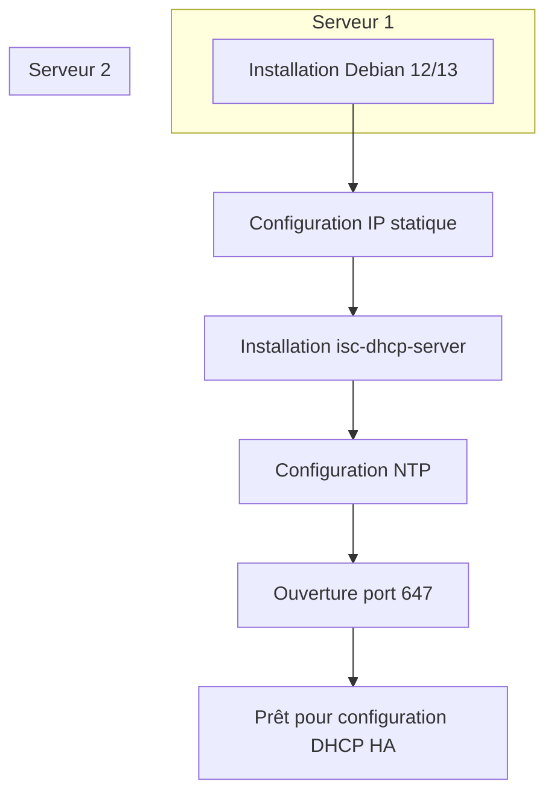
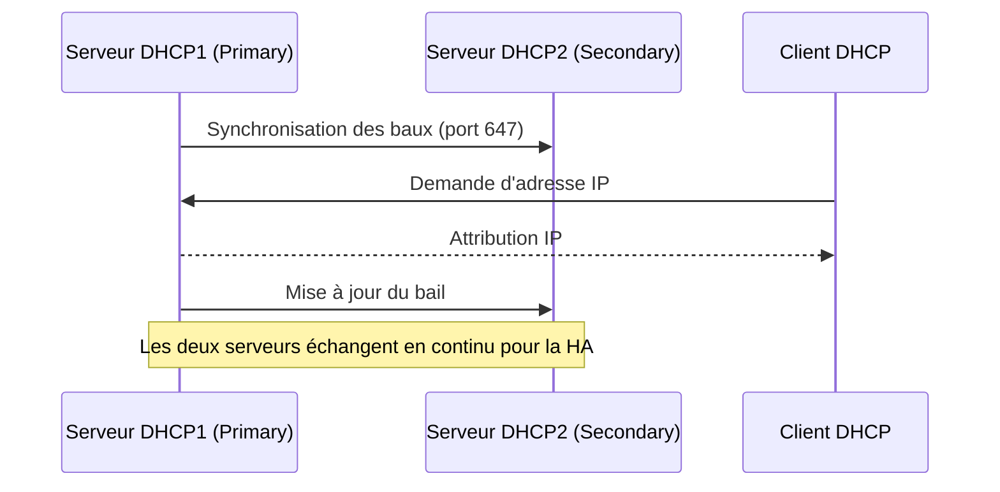

# Procédure pédagogique : Mise en place d'une solution DHCP Haute Disponibilité (HA) sous Debian 12 & 13

---

## 1. Présentation de la solution DHCP HA

La haute disponibilité (HA) pour DHCP consiste à avoir deux serveurs DHCP synchronisés, capables de prendre le relais en cas de panne de l’un d’eux. Sous Linux (Debian), on utilise généralement le mode "failover" intégré à ISC DHCP.

### Schéma général

```mermaid
graph TD;
    DHCP1[Serveur DHCP 1 (Active/Passive)] <--> DHCP2[Serveur DHCP 2 (Active/Passive)]
    DHCP1 --> LAN[Réseau LAN]
    DHCP2 --> LAN
```

---

## Schéma : Préparation des serveurs



---

## 2. Préparation des serveurs

### 2.1. Prérequis

**Explications pédagogiques :**
- Le choix de deux serveurs permet de simuler une architecture redondante.
- La synchronisation de l’heure (NTP) est essentielle pour éviter les conflits de baux DHCP.
- L’ouverture du port 647 est indispensable pour la communication failover.

### 2.2. Installation des paquets
Sur les deux serveurs :
```bash
sudo apt update
sudo apt install isc-dhcp-server
```

**Détail :**
- `isc-dhcp-server` est le service le plus utilisé sous Linux pour distribuer des adresses IP dynamiques.
- L’installation doit être réalisée sur les deux serveurs pour garantir la redondance.

---

## 3. Configuration réseau

Assurez-vous que chaque serveur a une IP fixe sur le même réseau.
Exemple :

**Détail :**
- Une IP fixe est nécessaire pour que les serveurs puissent communiquer et que les clients les identifient.
- Vérifiez la configuration avec `ip a` ou `nmcli`.

---

## 4. Configuration du DHCP en mode failover

### 4.1. Fichier de configuration principal `/etc/dhcp/dhcpd.conf`

#### Sur dhcp1 :
```conf
failover peer "dhcp-ha" {
  primary;
  address 192.168.1.10;
  port 647;
  peer address 192.168.1.11;
  peer port 647;
  max-response-delay 60;
  max-unacked-updates 10;
  load balance max seconds 3;
  mclt 3600;
}

subnet 192.168.1.0 netmask 255.255.255.0 {
  pool {
    failover peer "dhcp-ha";
    range 192.168.1.100 192.168.1.200;
    allow unknown-clients;
  }
  option routers 192.168.1.1;
  option domain-name-servers 8.8.8.8, 8.8.4.4;
}
```

**À faire :**
1. Éditez le fichier `/etc/dhcp/dhcpd.conf` sur chaque serveur.
2. Adaptez les IP selon votre réseau.
3. Vérifiez la syntaxe avec `dhcpd -t`.

**Concept pédagogique :**
Le mode failover permet à deux serveurs DHCP de partager la gestion des baux. Si l’un tombe, l’autre continue à distribuer les adresses.

**Explication des paramètres principaux :**
- `primary` / `secondary` : définit le rôle du serveur.
- `address` / `peer address` : IP des serveurs.
- `mclt` : durée maximale pendant laquelle un serveur peut attribuer un bail sans synchronisation.
- `max-response-delay` : délai maximal de réponse entre les serveurs.
- `load balance max seconds` : équilibre la charge entre les deux serveurs.

#### Sur dhcp2 :
```conf
failover peer "dhcp-ha" {
  secondary;
  address 192.168.1.11;
  port 647;
  peer address 192.168.1.10;
  peer port 647;
  max-response-delay 60;
  max-unacked-updates 10;
  load balance max seconds 3;
  mclt 3600;
}

subnet 192.168.1.0 netmask 255.255.255.0 {
  pool {
    failover peer "dhcp-ha";
    range 192.168.1.100 192.168.1.200;
    allow unknown-clients;
  }
  option routers 192.168.1.1;
  option domain-name-servers 8.8.8.8, 8.8.4.4;
}
```

---

### 4.2. Fichier `/etc/default/isc-dhcp-server`
Vérifiez que l’interface réseau est bien renseignée (ex : `INTERFACESv4="eth0"`).

**Astuce :**
Utilisez la commande `ip a` pour identifier l’interface à renseigner.

---

## 5. Synchronisation des fichiers de baux

Le mode failover synchronise automatiquement les baux via le protocole DHCP. Il n’est pas nécessaire de synchroniser manuellement les fichiers `dhcpd.leases`.

**Explication :**
La synchronisation des baux garantit que les clients ne perdent pas leur adresse IP en cas de bascule. Les serveurs échangent en temps réel les informations de baux.

---

## Schéma : Flux de synchronisation DHCP Failover



---

## 6. Démarrage et vérification

Sur chaque serveur :
```bash
sudo systemctl restart isc-dhcp-server
sudo systemctl status isc-dhcp-server
```

Vérifiez les logs pour s’assurer que la synchronisation s’effectue :
```bash
tail -f /var/log/syslog
```
Vous devez voir des messages du type "DHCP failover peer dhcp-ha: communications established".

**Conseil pédagogique :**
- Utilisez les logs pour comprendre le dialogue entre les serveurs.
- En cas d’erreur, vérifiez la configuration et la connectivité réseau.

---

## 7. Test de bascule

  `sudo systemctl stop isc-dhcp-server`

- Vérifiez que dhcp2 continue à distribuer des baux.
- Redémarrez dhcp1 et vérifiez la resynchronisation.

**À observer :**
- Les clients doivent continuer à recevoir des adresses IP.
- Les logs montrent la reprise de la synchronisation.

---

## Schéma : Test de bascule DHCP HA

```mermaid
flowchart LR
  DHCP1[DHCP1 (Primary)] -- Arrêt service --> X[Indisponible]
  DHCP2[DHCP2 (Secondary)] -- Prend le relais --> Clients[Clients DHCP]
  X -. Redémarrage .-> DHCP1
  DHCP1 -- Synchronisation --> DHCP2
  DHCP2 -- Distribution IP --> Clients
```

---

## 8. Schéma de fonctionnement failover

```mermaid
graph TD;
    DHCP1[DHCP1 (Primary)] <--> DHCP2[DHCP2 (Secondary)]
    DHCP1 --> Clients[Clients]
    DHCP2 --> Clients
```

---

## 9. Conseils pédagogiques


---

## Pour aller plus loin

- Essayez de modifier la plage d’adresses et observez le comportement.
- Ajoutez des réservations d’adresses pour certains clients.
- Simulez une coupure réseau entre les serveurs et analysez les logs.
- Documentez chaque étape avec vos propres commentaires pour renforcer l’apprentissage.

---

## 10. Ressources complémentaires

- [Documentation officielle ISC DHCP](https://kb.isc.org/docs/aa-00336)
- [Debian Wiki DHCP](https://wiki.debian.org/DHCP_Server)

---

> Pour toute question ou adaptation, n’hésitez pas à demander !
