<div align="center">

  <br></br>
  
  <a href="https://github.com/0xCyberLiTech">
  
  </a>
  
  <br></br>

  <h2>Laboratoire numérique pour la cybersécurité, Linux & IT</h2>
  
  <p align="center">
      <a href="https://0xcyberlitech.github.io/">
        
      </a>
      <a href="https://github.com/0xCyberLiTech">
        
      </a>
      <a href="https://github.com/0xCyberLiTech/Cybersecurite/releases/latest">
        
      </a>
      <a href="https://github.com/0xCyberLiTech/Cybersecurite/blob/main/CHANGELOG.md">
        
      </a>
      <a href="https://github.com/0xCyberLiTech?tab=repositories">
        
      </a>
  </p>

</div>

<!-- Optimisation SEO : DHCP, Dynamic Host Configuration Protocol, serveur DHCP, configuration IP, adresse IP automatique, réseau, administration système, Linux, Debian, cybersécurité, sécurité informatique, IT, open source, tutoriels, guides, formation, expertise, étudiants, professionnels, bonnes pratiques, ressources techniques, infrastructure réseau, services réseaux, supervision, logs, monitoring, cloud, virtualisation, DevSecOps -->

<div align="center">
  
</div>

<div align="center">
  <p>
    <strong>Cybersécurité</strong>  • <strong>Linux Debian</strong>  • <strong>Sécurité informatique</strong> 
  </p>
</div>

---

## 🚀 À propos & Objectifs

Ce projet propose des solutions innovantes et accessibles en cybersécurité, avec une approche centrée sur la simplicité d’utilisation et l’efficacité. Il vise à accompagner les utilisateurs dans la protection de leurs données et systèmes, tout en favorisant l’apprentissage et le partage des connaissances.

Le contenu est structuré, accessible et optimisé SEO pour répondre aux besoins de :
- 🎓 Étudiants : approfondir les connaissances
- 👨‍💻 Professionnels IT : outils et pratiques
- 🖥️ Administrateurs système : sécuriser l’infrastructure
- 🛡️ Experts cybersécurité : ressources techniques
- 🚀 Passionnés du numérique : explorer les bonnes pratiques

---

## Procédure pédagogique : Mise en place d'une solution DHCP Haute Disponibilité (HA) sous Debian 12 & 13

---

## 1. Présentation de la solution DHCP HA

La haute disponibilité (HA) pour DHCP consiste à avoir deux serveurs DHCP synchronisés, capables de prendre le relais en cas de panne de l’un d’eux. Sous Linux (Debian), on utilise généralement le mode "failover" intégré à ISC DHCP.

### Schéma général

```mermaid
flowchart TD
  DHCP1[Serveur DHCP 1 (Active/Passive)] --- LAN[Réseau LAN]
  DHCP2[Serveur DHCP 2 (Active/Passive)] --- LAN
  DHCP1 <--> DHCP2
```

---

## Schéma : Préparation des serveurs

```mermaid
flowchart TD
  S1[Serveur 1 : Debian 12/13]
  S2[Serveur 2 : Debian 12/13]
  S1 --> IP1[IP statique]
  S2 --> IP2[IP statique]
  IP1 --> DHCP1[Installation isc-dhcp-server]
  IP2 --> DHCP2[Installation isc-dhcp-server]
  DHCP1 --> NTP1[Configuration NTP]
  DHCP2 --> NTP2[Configuration NTP]
  NTP1 --> PORT1[Ouverture port 647]
  NTP2 --> PORT2[Ouverture port 647]
  PORT1 --> READY1[Prêt pour DHCP HA]
  PORT2 --> READY2[Prêt pour DHCP HA]
```


```

---

## 2. Préparation des serveurs

### 2.1. Prérequis

**Explications pédagogiques :**
- Le choix de deux serveurs permet de simuler une architecture redondante.
- La synchronisation de l’heure (NTP) est essentielle pour éviter les conflits de baux DHCP.
- L’ouverture du port 647 est indispensable pour la communication failover.

### 2.2. Installation des paquets
Sur les deux serveurs :
```bash
sudo apt update
sudo apt install isc-dhcp-server
```

**Détail :**
- `isc-dhcp-server` est le service le plus utilisé sous Linux pour distribuer des adresses IP dynamiques.
- L’installation doit être réalisée sur les deux serveurs pour garantir la redondance.

---

## 3. Configuration réseau

Assurez-vous que chaque serveur a une IP fixe sur le même réseau.
Exemple :

**Détail :**
- Une IP fixe est nécessaire pour que les serveurs puissent communiquer et que les clients les identifient.
- Vérifiez la configuration avec `ip a` ou `nmcli`.

---

## 4. Configuration du DHCP en mode failover

### 4.1. Fichier de configuration principal `/etc/dhcp/dhcpd.conf`

#### Sur dhcp1 :
```conf
failover peer "dhcp-ha" {
  primary;
  address 192.168.1.10;
  port 647;
  peer address 192.168.1.11;
  peer port 647;
  max-response-delay 60;
  max-unacked-updates 10;
  load balance max seconds 3;
  mclt 3600;
}

subnet 192.168.1.0 netmask 255.255.255.0 {
  pool {
    failover peer "dhcp-ha";
    range 192.168.1.100 192.168.1.200;
    allow unknown-clients;
  }
  option routers 192.168.1.1;
  option domain-name-servers 8.8.8.8, 8.8.4.4;
}
```

**À faire :**
1. Éditez le fichier `/etc/dhcp/dhcpd.conf` sur chaque serveur.
2. Adaptez les IP selon votre réseau.
3. Vérifiez la syntaxe avec `dhcpd -t`.

**Concept pédagogique :**
Le mode failover permet à deux serveurs DHCP de partager la gestion des baux. Si l’un tombe, l’autre continue à distribuer les adresses.

**Explication des paramètres principaux :**
- `primary` / `secondary` : définit le rôle du serveur.
- `address` / `peer address` : IP des serveurs.
- `mclt` : durée maximale pendant laquelle un serveur peut attribuer un bail sans synchronisation.
- `max-response-delay` : délai maximal de réponse entre les serveurs.
- `load balance max seconds` : équilibre la charge entre les deux serveurs.

#### Sur dhcp2 :
```conf
failover peer "dhcp-ha" {
  secondary;
  address 192.168.1.11;
  port 647;
  peer address 192.168.1.10;
  peer port 647;
  max-response-delay 60;
  max-unacked-updates 10;
  load balance max seconds 3;
  mclt 3600;
}

subnet 192.168.1.0 netmask 255.255.255.0 {
  pool {
    failover peer "dhcp-ha";
    range 192.168.1.100 192.168.1.200;
    allow unknown-clients;
  }
  option routers 192.168.1.1;
  option domain-name-servers 8.8.8.8, 8.8.4.4;
}
```

---

### 4.2. Fichier `/etc/default/isc-dhcp-server`
Vérifiez que l’interface réseau est bien renseignée (ex : `INTERFACESv4="eth0"`).

**Astuce :**
Utilisez la commande `ip a` pour identifier l’interface à renseigner.

---

## 5. Synchronisation des fichiers de baux

Le mode failover synchronise automatiquement les baux via le protocole DHCP. Il n’est pas nécessaire de synchroniser manuellement les fichiers `dhcpd.leases`.

**Explication :**
La synchronisation des baux garantit que les clients ne perdent pas leur adresse IP en cas de bascule. Les serveurs échangent en temps réel les informations de baux.

---

## Schéma : Flux de synchronisation DHCP Failover


---

## 6. Démarrage et vérification

Sur chaque serveur :
```bash
sudo systemctl restart isc-dhcp-server
sudo systemctl status isc-dhcp-server
```

Vérifiez les logs pour s’assurer que la synchronisation s’effectue :
```bash
tail -f /var/log/syslog
```
Vous devez voir des messages du type "DHCP failover peer dhcp-ha: communications established".

**Conseil pédagogique :**
- Utilisez les logs pour comprendre le dialogue entre les serveurs.
- En cas d’erreur, vérifiez la configuration et la connectivité réseau.

---

## 7. Test de bascule

  `sudo systemctl stop isc-dhcp-server`

- Vérifiez que dhcp2 continue à distribuer des baux.
- Redémarrez dhcp1 et vérifiez la resynchronisation.

**À observer :**
- Les clients doivent continuer à recevoir des adresses IP.
- Les logs montrent la reprise de la synchronisation.

---

## Schéma : Test de bascule DHCP HA

```mermaid
flowchart LR
  DHCP1[DHCP1 (Primary)] -- Arrêt service --> X[Indisponible]
  DHCP2[DHCP2 (Secondary)] -- Prend le relais --> Clients[Clients DHCP]
  X -. Redémarrage .-> DHCP1
  DHCP1 -- Synchronisation --> DHCP2
  DHCP2 -- Distribution IP --> Clients
```

---

## 8. Schéma de fonctionnement failover

```mermaid
graph TD;
    DHCP1[DHCP1 (Primary)] <--> DHCP2[DHCP2 (Secondary)]
    DHCP1 --> Clients[Clients]
    DHCP2 --> Clients
```

---

## 9. Conseils pédagogiques


---

## Pour aller plus loin

- Essayez de modifier la plage d’adresses et observez le comportement.
- Ajoutez des réservations d’adresses pour certains clients.
- Simulez une coupure réseau entre les serveurs et analysez les logs.
- Documentez chaque étape avec vos propres commentaires pour renforcer l’apprentissage.

---

## 10. Ressources complémentaires

- [Documentation officielle ISC DHCP](https://kb.isc.org/docs/aa-00336)
- [Debian Wiki DHCP](https://wiki.debian.org/DHCP_Server)

---

<div align="center">
  <a href="https://github.com/0xCyberLiTech" target="_blank" rel="noopener">
    
  </a>
</div>

<div align="center">
  <b>🔒 Un guide proposé par <a href="https://github.com/0xCyberLiTech">0xCyberLiTech</a> • Pour des tutoriels accessibles à tous. 🔒</b>
</div>

