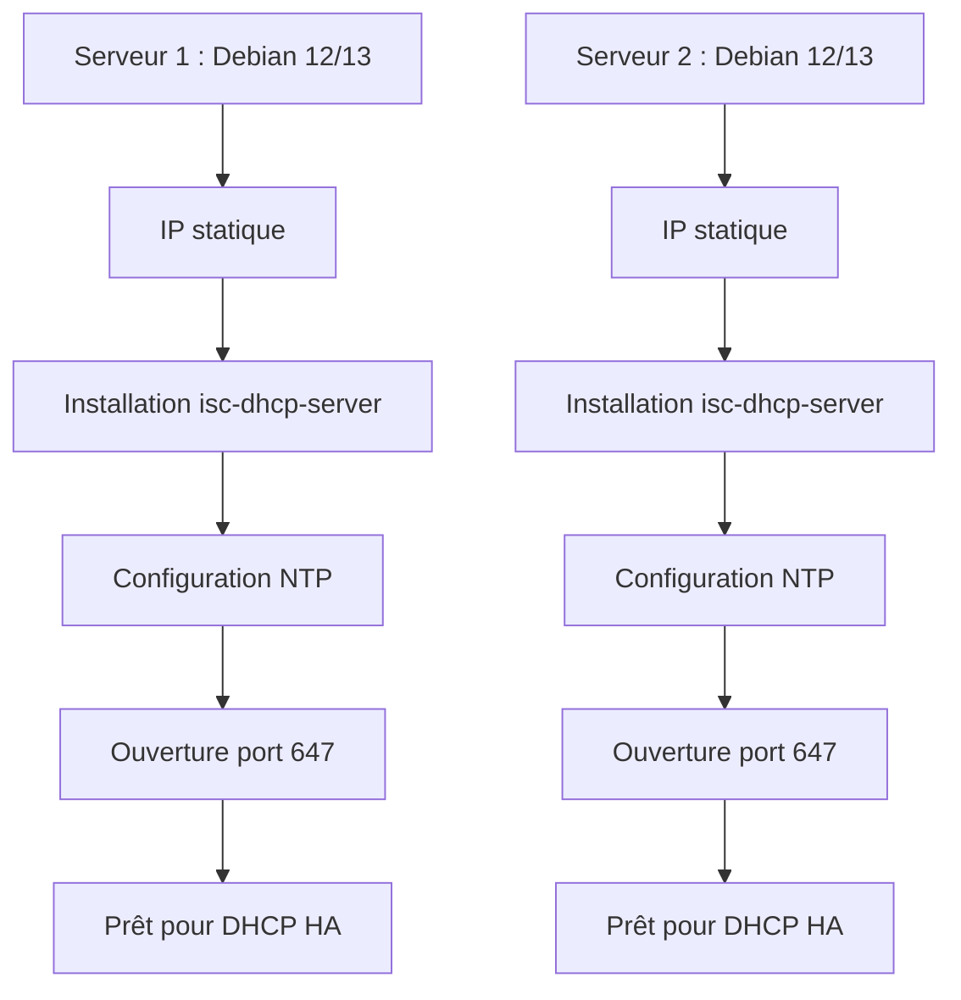
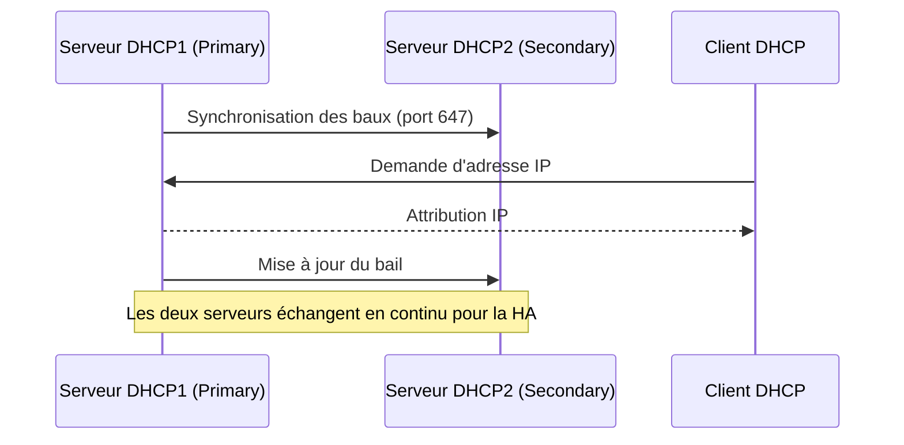

<div align="center">

<br>

<a href="https://github.com/0xCyberLiTech">
  
</a>

<br>

<h2>Laboratoire numérique pour la cybersécurité, Linux & IT.</h2>

<p align="center">
  <a href="https://0xcyberlitech.github.io/">
    
  </a>
  <a href="https://github.com/0xCyberLiTech">
    
  </a>
  <a href="https://github.com/0xCyberLiTech/Cybersecurite/releases/latest">
    
  </a>
  <a href="https://github.com/0xCyberLiTech/Cybersecurite/blob/main/CHANGELOG.md">
    
  </a>
  <a href="https://github.com/0xCyberLiTech?tab=repositories">
    
  </a>
</p>

</div>

<div align="center">
  
</div>

<div align="center">
  <p>
    <strong>Cybersécurité</strong>  • <strong>Linux Debian</strong>  • <strong>Sécurité informatique</strong> 
  </p>
</div>

---

<div align="center">

## À propos & Objectifs

</div>

Ce projet propose des solutions innovantes et accessibles en cybersécurité, avec une approche centrée sur la simplicité d’utilisation et l’efficacité. Il vise à accompagner les utilisateurs dans la protection de leurs données et systèmes, tout en favorisant l’apprentissage et le partage des connaissances.

Le contenu est structuré, accessible et optimisé SEO pour répondre aux besoins de :
- 🎓 Étudiants : approfondir les connaissances
- 👨‍💻 Professionnels IT : outils et pratiques
- 🖥️ Administrateurs système : sécuriser l’infrastructure
- 🛡️ Experts cybersécurité : ressources techniques
- 🚀 Passionnés du numérique : explorer les bonnes pratiques

---

## Mise en place d'une solution DHCP Haute Disponibilité (HA) sous Debian 12 & 13

---

## 1. Présentation de la solution DHCP HA

La haute disponibilité (HA) pour DHCP consiste à avoir deux serveurs DHCP synchronisés, capables de prendre le relais en cas de panne de l’un d’eux. Sous Linux (Debian), on utilise généralement le mode "failover" intégré à ISC DHCP.

### Schéma général


---

## 2. Préparation des serveurs

### Schéma : Préparation des serveurs



### 2.1. Prérequis

- Deux serveurs pour simuler une architecture redondante.
- Synchronisation horaire (NTP) pour éviter les conflits de baux DHCP.
- Ouverture du port 647 pour la communication failover.

### 2.2. Installation des paquets

Sur les deux serveurs :
```bash
sudo apt update
sudo apt install isc-dhcp-server
```

---

## 3. Configuration réseau

Assurez-vous que chaque serveur a une IP fixe sur le même réseau.
- Utilisez `ip a` ou `nmcli` pour vérifier.

---

## 4. Configuration du DHCP en mode failover

### 4.1. Fichier de configuration principal `/etc/dhcp/dhcpd.conf`

#### Sur dhcp1 :
```conf
failover peer "dhcp-ha" {
  primary;
  address 192.168.1.10;
  port 647;
  peer address 192.168.1.11;
  peer port 647;
  max-response-delay 60;
  max-unacked-updates 10;
  load balance max seconds 3;
  mclt 3600;
}

subnet 192.168.1.0 netmask 255.255.255.0 {
  pool {
    failover peer "dhcp-ha";
    range 192.168.1.100 192.168.1.200;
    allow unknown-clients;
  }
  option routers 192.168.1.1;
  option domain-name-servers 8.8.8.8, 8.8.4.4;
}
```

#### Sur dhcp2 :
```conf
failover peer "dhcp-ha" {
  secondary;
  address 192.168.1.11;
  port 647;
  peer address 192.168.1.10;
  peer port 647;
  max-response-delay 60;
  max-unacked-updates 10;
  load balance max seconds 3;
  mclt 3600;
}

subnet 192.168.1.0 netmask 255.255.255.0 {
  pool {
    failover peer "dhcp-ha";
    range 192.168.1.100 192.168.1.200;
    allow unknown-clients;
  }
  option routers 192.168.1.1;
  option domain-name-servers 8.8.8.8, 8.8.4.4;
}
```

**À faire :**
1. Éditez `/etc/dhcp/dhcpd.conf` sur chaque serveur.
2. Adaptez les IP selon votre réseau.
3. Vérifiez la syntaxe avec `dhcpd -t`.

---

### 4.2. Fichier `/etc/default/isc-dhcp-server`

Vérifiez que l’interface réseau est bien renseignée (ex : `INTERFACESv4="eth0"`).
- Utilisez `ip a` pour identifier l’interface à renseigner.

---

## 5. Synchronisation des fichiers de baux

Le mode failover synchronise automatiquement les baux via le protocole DHCP (port 647).
- Pas besoin de synchroniser manuellement les fichiers `dhcpd.leases`.

---

## 6. Schéma : Flux de synchronisation DHCP Failover



---

## 7. Démarrage et vérification

Sur chaque serveur :
```bash
sudo systemctl restart isc-dhcp-server
sudo systemctl status isc-dhcp-server
```

Vérifiez les logs pour s’assurer que la synchronisation s’effectue :
```bash
tail -f /var/log/syslog
```
Vous devez voir : "DHCP failover peer dhcp-ha: communications established".

---

## 8. Test de bascule

```mermaid
flowchart TD
  DHCP1_OFF[DHCP1 (Primary) [OFF]]
  DHCP2_ON[DHCP2 (Secondary) [ON]]
  Clients[Clients DHCP]
  DHCP2_ON --- Clients
```

- Arrêtez le service sur dhcp1 : `sudo systemctl stop isc-dhcp-server`
- Vérifiez que dhcp2 distribue toujours les baux.
- Redémarrez dhcp1 et vérifiez la resynchronisation.

---

## 9. Schéma de fonctionnement failover

```mermaid
flowchart TD
  DHCP1[DHCP1 (Primary)]
  DHCP2[DHCP2 (Secondary)]
  Clients[Clients DHCP]
  DHCP1 --- DHCP2
  DHCP1 --- Clients
  DHCP2 --- Clients
```

---

## 10. Conseils pédagogiques

- Comprenez chaque paramètre de la configuration DHCP et failover.
- Testez la bascule en coupant un serveur et observez le comportement.
- Analysez les logs pour suivre la synchronisation.
- Documentez vos manipulations pour consolider vos acquis.
- Utilisez des schémas pour visualiser l’architecture et les flux réseau.
- Expérimentez différentes plages et options DHCP.

---

## Pour aller plus loin

- Modifiez la plage d’adresses et observez le comportement.
- Ajoutez des réservations d’adresses.
- Simulez une coupure réseau entre les serveurs et analysez les logs.
- Documentez chaque étape pour renforcer l’apprentissage.

---

## 11. Ressources complémentaires

- [Documentation officielle ISC DHCP](https://kb.isc.org/docs/aa-00336)
- [Debian Wiki DHCP](https://wiki.debian.org/DHCP_Server)

---

<div align="center">
  <a href="https://github.com/0xCyberLiTech" target="_blank" rel="noopener">
    
  </a>
</div>

<div align="center">
  <b>🔒 Un guide proposé par <a href="https://github.com/0xCyberLiTech">0xCyberLiTech</a> • Pour des tutoriels accessibles à tous. 🔒</b>
</div>
